## 下载
下载地址：[https://www.charlesproxy.com/ (charles 官网)](https://www.charlesproxy.com/)
## 安装
和一般软件安装过程一样，略
## 破解（请支持正版，仅供技术交流。）
[在线破解](https://www.zzzmode.com/mytools/charles/)
#### 描述
此工具用于生成破解后的charles.jar文件
#### 用法
输入RegisterName(此名称随意，用于显示 Registered to xxx)，选择已安装的版本，点击生成，并下载charles.jar文件
替换本地charles.jar文件

macOS: `/Applications/Charles.app/Contents/Java/charles.jar`

Windows: `C:\Program Files\Charles\lib\charles.jar`
#### 注意
仅用于学习交流，请勿用于任何商业用途

## http抓包
- 开启macOS Proxy代理
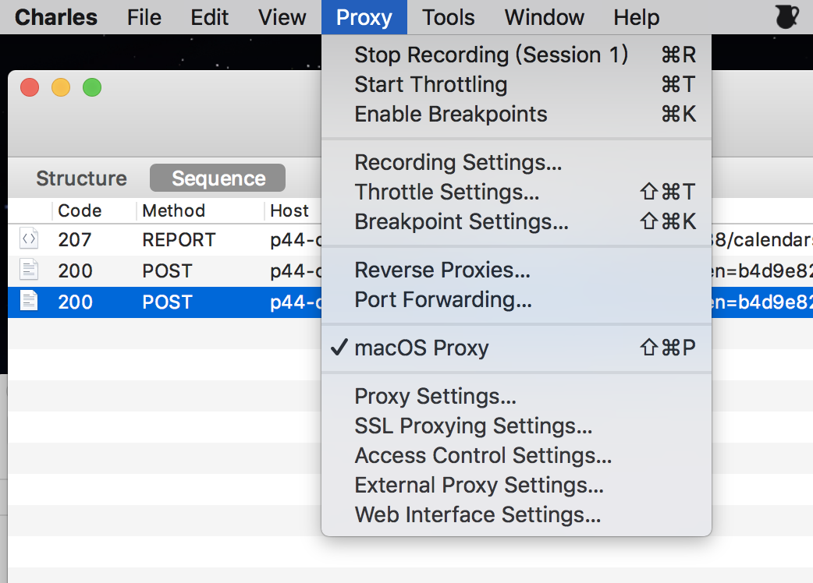

- 在 Mac 中打开 Charles 应用；

- 设置手机HTTP代理：确保移动设备与 Mac 笔记本在同一局域网内，添加代理ip地址（Mac内网地址）和端口号（8888），这里以 iPhone为例，如图所示：

- 在iOS设备上访问接口数据，在 Charles 弹出的确认窗中选择 Allow，允许即可。

## https抓包
- 开启SSL代理功能
依次按下图点击

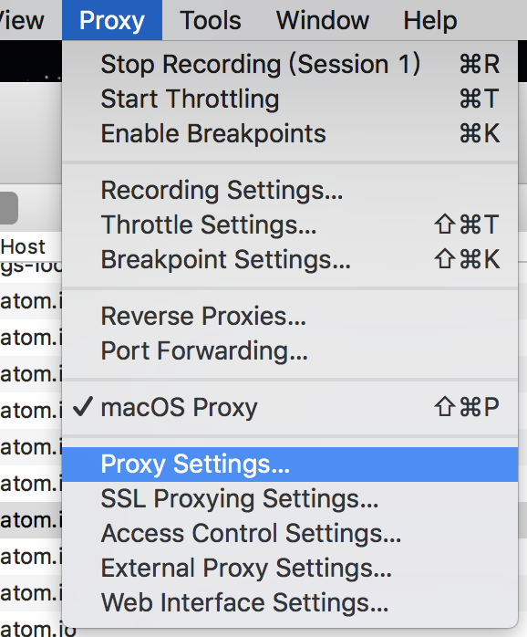

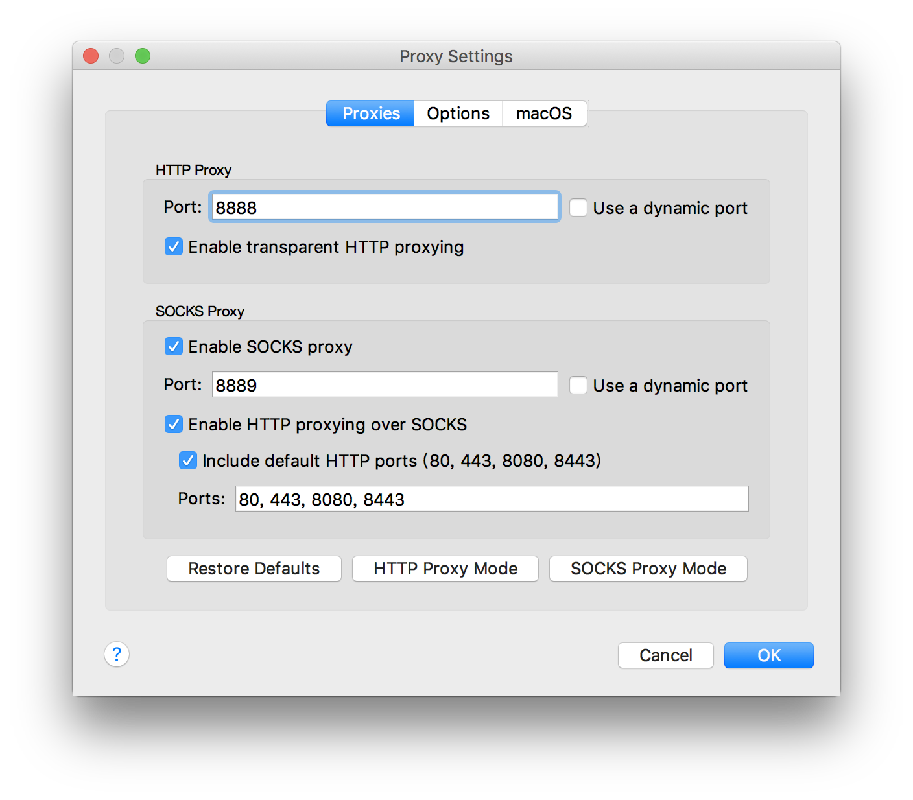

然后设置SSL Proxying Settings

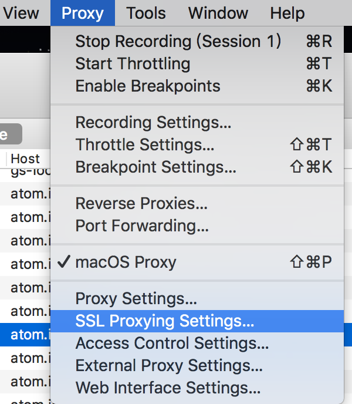

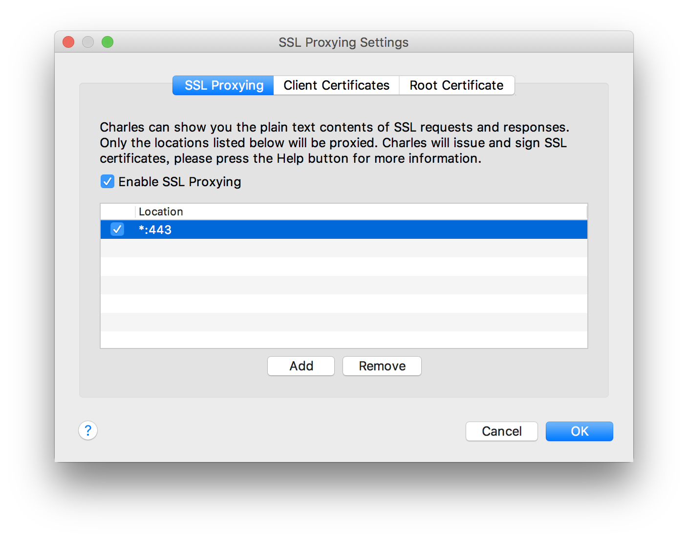

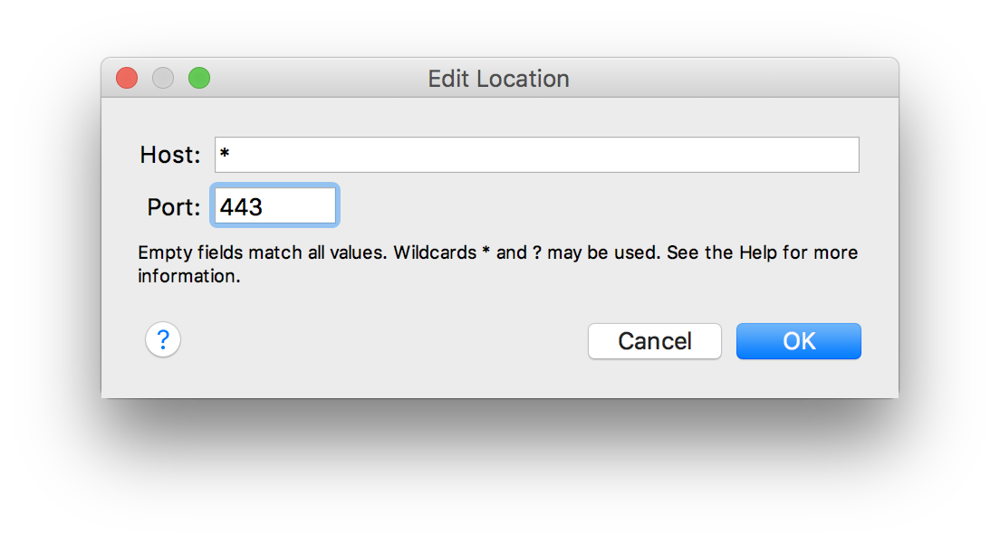

这样charles的设置就基本完成了。

- 给Mac安装证书
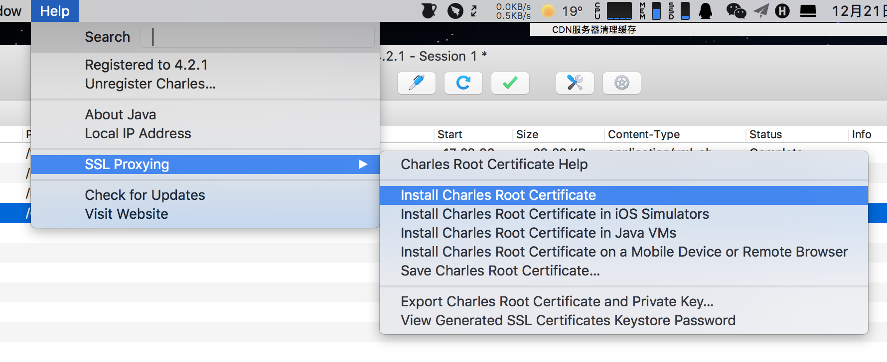

打开Charles，在Menu选择SSL Proxying > Install Charles Root Certificate，Keychain Access（钥匙访问串）被打开，我们可以看到Charles Certificate已经被安装，如图：

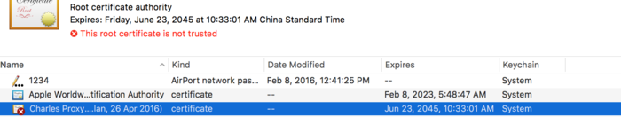

- 信任证书

双击该行弹出证书详情，选择“Always Trust”

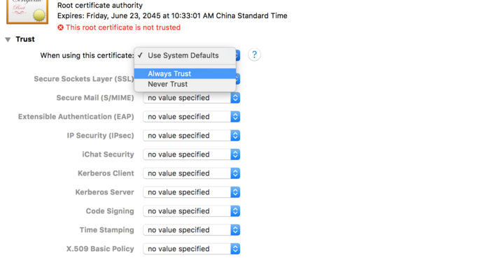

然后点击左上角的关闭,系统会弹出授权提示框,授权同意修改,回到列表,稍等,证书就刷新了,这个时候就可以用了

- 给手机安装证书

打开Charles，在Menu选择Help > SSL Proxying > Install Charles Root Certificate on a Mobile Device or Remote Browser，弹出提示框，如图：

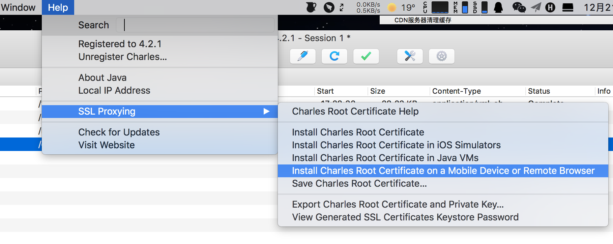

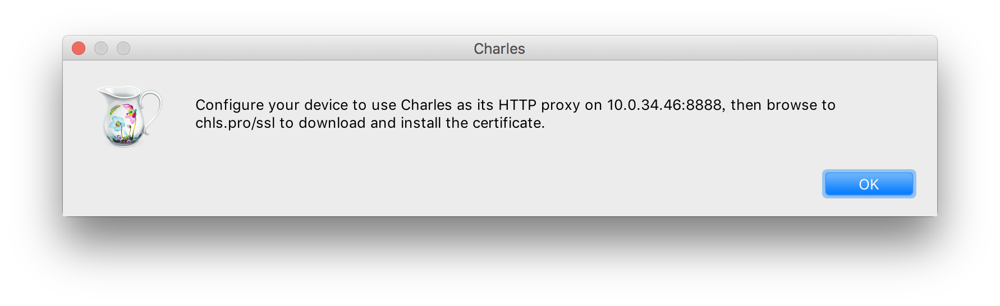

- 信任证书

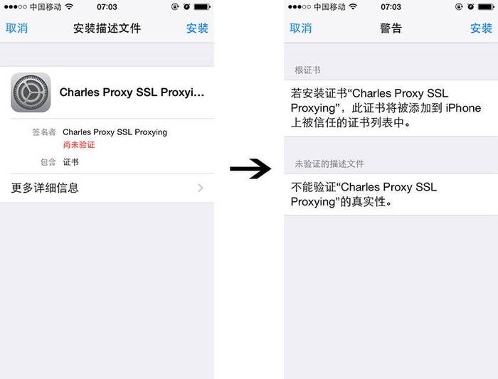

## 常见问题及注意事项
- Q: 电脑抓不到浏览器的请求
> A: 请确认电脑的没有开启vpn或者其他代理
- Q: 如果电脑能够抓到浏览器的请求，但是抓不到手机的请求
> A: 请先确认手机的网络和电脑的网络不是同一个wifi，如果都是连接通过Wi-Fi连接上网，是无法使用电脑charles代理，抓取到http/https请求的;
然后再检查代理配置的ip是否是电脑当前的ipv4的ip，mac里面是en0里面inet后面第一个ip

- 【注意⚠️】有朋友说Safari浏览器输入这个网址chls.pro/ssl安装不了证书的情况,亲测要(1)设置好手机HTTP代理 (2)电脑上Charles要开着

- 【注意⚠️】iOS 10.3以上的系统，需要在 设置→通用→关于本机→证书信任设置 里面启用完全信任Charles证书

- 【注意⚠️】不抓包请关闭手机HTTP代理，否则断开与电脑连接后会连不上网
